##Preamble

The COMPADRE and COMADRE databases are compiled from (mostly) published literature. The majority of this literature was published as peer-reviewed articles in academic journals, with a smaller number of data obtained from books, conference presentations etc. 

The data digitization team (The COMPADRINOs) read the literature and extract information in order to reconstruct the matrix analysed by the original researchers. The extracted data are entered into Excel spreadsheets in a structured way. Wherever there are doubts about aspects of the data the team attempts to contact the researchers to resolve them. There are two types of Excel file in COMPADRE/COMADRE: (1) The DESCRIPTOR FILE(s) which contain metadata allowing the interpretation of the matrix data; and (2) the STACKED MATRIX FILE(s) which contain the matrices themselves, plus some additional matrix-specific information.

These data are compiled using a set of R scripts and released to the public as open access data via the website: www.compadre-db.org. 

This document outlines the way that the digitization team should enter data into the Excel sheets. It is primarily intended for internal use and as such includes information on some variables which are not released into the public domain. Nevertheless, in the interests of transparency we provide open access to the document here.

Questions or comments about this protocol should be addressed to Rob Salguero-Gómez (r.salguero@uq.edu.au) or Owen Jones (jones@biology.sdu.dk).

##General information

* This protocol is intended for both the COMPADRE Plant Matrix Database and the COMADRE Animal Matrix Database. Some variables pertain to _only_ one or the other database and are indicated as such in the text. 

* PDFs of new publications emailed to the COMPADRinos are to be saved under the “Literature” sub-folder of COMPADRE or COMADRE in the N://COMPADRE & COMADRE directory of the MPIDR server. Immediately after saving the PDF, a new entry must be opened with the “Species”, “Author”, “Journal”, and “Year” in the descriptor and stacked file.

* If you find additional sources _always_ save them and note them in additional sources.
All pieces of information extracted from PDFs must be highlighted directly on the PDF in yellow.

* If a PDF contains matrices/data from other papers and/or studies, this must be noted as “Not Primary Source” in the notes column of the species descriptors file.

* If additional PDFs are found with respect to a given species [population?], these must be inspected for any additional matrices with different model assumptions (e.g. different stages) and/or different study years, populations and/or treatments. If the paper provides new information, it must be included in the database as an additional species entry.

* Authors must only be contacted from the official email: compadre-contact@demogr.mpg.de.

* Latin names of species must be checked using reliable sources (e.g. Catalogue of Life [http://www.catalogueoflife.org/], iPlant Collaborative [http://www.iplantcollaborative.org/], Wikipedia [https://en.wikipedia.org/]) for spelling mistakes.

* The element-by-element mean values of unmanipulated (control) and treatment matrices are to be kept separate (i.e. never calculate mean matrices from a mixture of unmanipulated and treated matrices). Furthermore, mean matrices should never mix different treatments (e.g. do not calculate mean matrices for matrices with different grazing regimes). However, mean matrices _should_ be calculated for unmanipulated  matrices, and for matrices that have received the same treatments..

* When digitizing matrices, only colors from the color palette, which is given inside the Excel file, can be used in the stacked matrix file. Where matrices can be split, please always include an “A” matrix as well as “U”, “F” & “C” matrices (for explanation see here in the stacked matrix file. Present matrices from left-to-right in the order A, U, F, C. __Always__ split matrices if possible.

******

#Values used throughout the database

The following values are commonly used throughout the database.

__NA__ - Not available - The information is not available either because the author does not have it or because the information is not recognized as “priority” (see below)

__AFI__ - Asked for it - The information is not yet in the database, but the COMPADRino has already contacted the author requesting it (i.e. the author has not yet replied)

__NDY__ - Not digitized yet - The information has not yet been digitized. This is likely to occur when some priority information has been digitized for a given species, and the COMPADRino has moved onto another species without contacting an author for the missing information

__NC__ - Not calculated - Information was not calculated because its calculation is not sensible. For instance, latitudes and longitudes of various populations of the same species are not averaged and assigned to the grand-mean population matrix of the species. Same for ranges, where author provides a range of latitudes and longitudes for a given population. Ranges are noted into the observation column

__LAB__ - Laboratory - The author collected demographic data for the studied species in a laboratory or under greenhouse conditions – controlled, usually indoor, conditions that mean the study species is not affected by the environment conditions typical of the actual geographic location of the study

__FRANK__ - Frankenstein matrix - The author used demographic data from at least two other papers and calculated a *new* matrix out of that data. In those cases we typically have different study sites and years of study. For these data we do not calculate averages or ranges but instead enter __FRANK__.

************************************************

#Priority variables

The following is a list of variables that the COMPADRino team digitizes to the best of its effort, contacting the author when the information is not available in the manuscript when necessary.

* SpeciesAuthor
* Author
* Email
* Journal
* Year
* DOI/ISBN
* Ecoregion
* GrowthFormRaunkiaer (only for COMPADRE)
* Purposes
* StudyDuration
* AnnualPeriodicity
* NumberPopulations
* StudiedSex
* Geolocation and Altitude
* Continent
* Country

## References

* Caswell, H. (2001) Matrix population models. Second Edition. Sunderland, MA: Sinauer Associates.

* Olson, D.M., Dinerstein, E., Wikramanayake, E.D., Burgess, N.D., Powell, G.V., Underwood, E.C., D’amico, J.A., Itoua, I., Strand, H.E. & Morrison, J.C. (2001) Terrestrial Ecoregions of the World: A New Map of Life on Earth A new global map of terrestrial ecoregions provides an innovative tool for conserving biodiversity. BioScience, 51, 933–938.

* Salguero-Gómez, R., Jones, O. R., Archer, C. R., Buckley, Y. M., Che-Castaldo, J., Caswell, H., Hodgson, D., Scheuerlein, A., Conde, D. A., Brinks, E., de Buhr, H., Farack, C., Gottschalk, F., Hartmann, A., Henning, A., Hoppe, G., Römer, G., Runge, J., Ruoff, T., Wille, J., Zeh, S., Davison, R., Vieregg, D., Baudisch, A., Altwegg, R., Colchero, F., Dong, M., de Kroon, H., Lebreton, J.-D., Metcalf, C. J. E., Neel, M. M., Parker, I. M., Takada, T., Valverde, T., Vélez-Espino, L. A., Wardle, G. M., Franco, M., Vaupel, J. W. (2015), The COMPADRE Plant Matrix Database: an open online repository for plant demography. Journal of Ecology, 103: 202–218. doi: 10.1111/1365-2745.12334

************************************************

# DESCRIPTOR FILE

## Student

First name of COMPADRino

Possible values

* Alex
* Anne
* Claudia
* Christoph
* Erik
* Fränce
* Gesa
* Gabriel
* Hendrik
* Jakob
* Julia
* Stefan
* Veronika
* Rob
* Tara

Information for Species Descriptors file:

The fill color of the Student-column in the Species descriptors means the following:

* LIGHT ORANGE	The Transferred Column has been checked. The entry in that column is correct. If something was missing (see MissingData) author has been contacted again by Gesa or Fränce (in late 2014 / early 2015). Everything else is fine.
* DARK ORANGE	The Transferred Column has been checked. The entry in that column is correct but a problem occurred which is explained in the Notes (e.g. no mail address of author(s) found).

Note: Excel might color the cell (in green or orange) automatically when entering a new species. Please always change the fill color for all new entries into "no fill". The students who do the error-checking will change into orange/red/green when necessary.

Information for the Stacked File:

The color coding in the EnteredBy-column of the Stacked File means the following:

* RED	There is some problem with this entry, the student who entered the species is informed and works on the plant again
* ORANGE	The entry is checked once (e.g. by Gesa). No faults have been found.
* GREEN	The entry has been checked twice. No faults have been found. Plant is ready to go online.

Excel might color the cell (in green or orange) automatically when entering a new species. Please always change the fill color for all new entries into "no fill". The students who do the error-checking will change into orange/red/green when necessary.

************************************************

## Notes

This column is intended to record any important issues or general notes about the data for the use of the COMPADRE/COMADRE team. It should be ensured that these entries include only sensible informative key points/sentences that also others can understand. Use __English__ only.

************************************************

## VersionRelease

The Version number of the database where the data is/will be released. e.g. 3.0, 3.1. 
Where the data are not yet to be released (for example, because the data are incomplete) an "X" is used in place of a version number. For all future digitization, an "X" should be placed in the version record. These will be replaced with an appropriate version number by Owen or Rob at a later date.

************************************************

## Transferred

Record the status of transference of matrices into the stacked file. 

__Yes__	 -- All variables (geolocation, individual matrices) for which the author had data have been transferred. It’s impossible to get missing data. All available matrices have been transferred. No more matrices are available.

If there is no email address for an author of a paper, but that paper has a matrix that can be digitized – enter the matrix to the stacked file and enter all information that is available from the paper into the descriptor, all missing information get an NA and we list the species as “transferred-Yes”

__Partly__ -  Only sections have been transferred. Some information is missing, which is reported in the column “Missing data” below. At least one matrix is transferred into the stacked file.
Check out E-Mail - Reply under "Contacted" to find out what to do when author does not answer.

__No__ - Nothing has yet been transferred, but the COMPADRino has started working on this species.

If the matrix cannot be digitized, that paper reference should be deleted from both the species descriptor file _and_ the stacked matrix file. Make a note of this deleted paper, using the normal format, in a NEW PAGE of the species descriptor file, called “deleted papers”, make a short note why it was deleted (for example no matrix).

************************************************

## MissingData

What data are still missing?

* __M__ - All matrices missing
* __I__ - Only individual matrices are missing
* __L__ - Labels are missing (e.g. information about the populations and years)
* __S__ - Information about study site missing (e.g. country, geolocation, WithinSite etc)
* __O__ - Other priority information missing
* __No__ - Everything is digitized

If more than one piece of information is missing, these are separated with ";" (without white-space in between), e.g. "I;S;O".

************************************************

## DateDigitalization

Records the date when COMPADRino started working on this species resp. when Matrix was digitized in stacked file. Dates should be recorded in US date format: mm.dd.yyyy, e.g. 12.25.2015 for 25th Dec 2015.

************************************************
## Embargo

If the author does not wish to make personally communicated data available, the data will be under embargo until the following date. At that point, an automatic reminder will go out to the author. The data will not become public until explicit permission has been given by the author. The date should be recorded in US date format (mm.dd.yyyy), or as NA when there if no embargo.

************************************************
## GrowthType (P)

This entry applies only to plants and records the plant/algae type, based mainly on architectural organization.

Possible values are:

* Algae
* Annual
* Bryophyte
* Epiphyte
* Fern
* Herbaceous perennial
* Liana
* Palm
* Shrub
* Succulent
* Tree

The species should be assigned to one of these possible values using the description of plant growth type provided by the author and by reference to other sources (e.g. other publications).

Note about the Annual category: Typically plant ecologists also refer to pseudo-annual species as being "biennials". The main difference between the annuals and biennials is that annual species complete their life cycle (are born, grow, reproduce and die) within a single year, whereas biennials have the WHAT HAPPENED HERE???

************************************************

## Class (A)

This entry only applies to animals. For animals, taxonomic class is recorded in both the Descriptors file and the Stacked Matrix file. This information is intended for internal use and reflects how our PDF library is organized on our servers.

Possible values include:

* Actinopterygii
* Amphibia
* Anthozoa
* Arachnida
* Ascidiacea
* Aves
* Bivalvia
* Branchiopoda
* Cephalaspidomorphi
* Chondrichthyes
* Chromadorea
* Clitellata
* Demospongiae
* Diplopoda
* Echinoidea
* Eurotatoria
* Gastropoda
* Gymnolaemata
* Malacostraca
* Mammalia
* Maxillopoda
* Merostomata
* Onychophorida
* Ostracoda
* Polychaeta
* Reptilia
* Secernentea
* Spirochaetes

************************************************

## SpeciesAuthor

The Latin binomial name of the species as reported in the publication. Note that this may not be the same as the currently accepted name. This should be recorded as "Genus_species". It should _always_ include the genus and the species names. Where the paper authors have given infra-specific names information on variety and subspecies should also be added (see below).

__var.__ - Where the publication refers to an intraspecific variety, this is indicated with "var." followed by the variety name, e.g. “Pityopsis_aspera_var._aspera"
__subsp.__ - Where the study refers to an intraspecific subspecies, this is indicated with "subsp." followed by the subspecies name, e.g. "Anthyllis_vulneraria_subsp._alpicola"

The word following “var.”, “subsp.” or “cf.” must not be capitalized. Excel will try to capitalize it via auto-correct because it follows a period punctuation. 

Always use an underscore "_" to substitute spaces (e.g. write "Cryptantha_flava"" instead of "Cryptantha flava").

If two or more different demographic studies exist for a particular species, these should be digitized with concatenated numbers after the genus_species starting with “2” (e.g. “Rosa_sempervirens”, “Rosa_sempervirens_2”, “Rosa_sempervirens_3”).

Exactly the same naming convention __must__ be used in both the Species Descriptor and Stacked Matrix files. 

************************************************

## CommonName

Records the common name as used in the publication. Separate multiple names with a semi-colon (";"). If there is no common name used in the publication, record "NA".	

************************************************

## Authors

Last name of all authors on the publication. Separate multiple names with "; ".
Note that __all__ authors named in the publication should be recorded in the same order as in the publication. E.g. for the Compadre-paper: Salguero-Gómez; Jones; Archer; Buckley; Che-Castaldo; Caswell; Scheuerlein; Conde; Baudisch; Brinks; de Buhr; Farack; Gottschalk; Hartmann; Henning; Hoppe; Römer; Runge; Ruoff T; Wille J; Zeh; Vieregg; Altwegg; Colchero; Dong; Hodgson; de Kroon; Lebreton; Metcalf; Neel; Parker; Takada; Valverde; Vélez-Espino; Wardle; Franco; Vaupel.

************************************************

## Journal

Record the name of the journal from which data were sourced. If the data were sourced from a book, thesis, report, or conference talk/poster, record that as appropriate. For journal abbreviations see list here: http://images.webofknowledge.com/WOK46/help/WOS/A_abrvjt.html.

If no abbreviation is available in both of those list, take a look into the paper. Often there are abbreviations in the left corner of the paper or at the first page.

* Journal Abbreviation (e.g. J. Ecol.) - Where the data come from a scientific journal article, the abbreviated journal name is given. We use the standard abbreviation of the journal using the BIOSIS Format.
* Book - Matrices are from a book, or book chapter. Note: If our source is a book name the author of the related chapter in Authors, not the author of the book.
* PhD thesis	- Matrices are from a doctoral thesis.
* MSc thesis	- Matrices are from a masters thesis.
* Report	- Matrices are from a report.
* Conference Talk	- Matrices reported in a conference talk.
* Conference Poster	- Matrices reported in a conference poster.

************************************************

## YearPublication

Year of publication of the source publication. This should be recorded as YYYY e.g. 2002.

************************************************

## CorrespondingAuthor

Last name of corresponding author(s). Note that the corresponding author may not necessarily be the first author. When no author is named as the corresponding one in the paper we use the first author. Separate multiple names with ";" when pertinent.

************************************************

## Email

For communication with the corresponding author record the email address, followed by the year in which the email address last worked or when the paper has been published to distinguish between old and new addresses. If email address doesn't work anymore enter "dead" instead of the year (note that this does not mean that the author is dead!). The author's email address can be obtained from the publication, from related papers, from internet searches, and personal communication etc.

e.g. jones@biology.sdu.dk (2015)

************************************************

## Contacted 

Record the date(s) when the publication author was contacted asking for information in US date format (mm.dd.yyyy). Authors should always be contacted from the compadre-contact@demogr.mpg.de email address rather than a personal email address.

Procedure for lack of response depends on the age of the paper:

* For papers older than 1990: When the corresponding author does not reply to your third email, or you cannot find their email address (e.g. in old publication) or reach their coauthors, then change “Partly” to “Yes” in Transferred column.

* For more recent papers (published after 1990): If the authors (and coauthors) do not reply after the third time you have contacted them, please pass the email that you have sent them to Owen and Rob. If they cannot make contact, they will change “Partly” to “Yes” in Transferred column.

If you were not able to find an email address of any of the authors of a paper (and also Rob and Owen don't know one), but that paper has a matrix that can be digitized – enter the matrix to the stacked file and enter all information that are available from the paper into the descriptor, all missing information get an NA and we list the species as “transferred-Yes”, still enter the missing information into MissingData

************************************************

##ContentEmail 

This records the information that was requested from the author. Use the same format as for "Missing Data" above. If multiple pieces of information are requested, separate with "; ". If the author has been asked for something other than the standard missing information, a short note should be left, e.g. "is the species clonal?".

************************************************

##Reply 

Did the author reply to a request for further information. This should record a brief answer given by the author, or "No" (no response yet). Note: Always change __Reply__ from "NA"" / "nothing" to "No" when author has been contacted, and update the entry as soon as a reply is received.

************************************************

## DOI/ISBN

Records Digital Object Identifier (DOI) or International Standard Book Number (ISBN) codes that identifies the source material. In more recent papers you may find the DOI somewhere at the beginning of the paper. You may also search for it in the Web of Knowledge.

************************************************

## AdditionalSource

Record additional source(s) used to reconstruct the matrix, or to obtain additional ancillary data.
This should be formatted as Lastname Journal YearPublication additional information, e.g. Godinez-Alvarez Bot Rev 2003, or e.g. Schmidt J Ecol 2007 Appendix A1

************************************************

## Database

Over the years COMPADRE database has obtained data from similar matrix databases. This column records whenever this is the case. The possible values are:

* Exeter - David Hodgson
* COMPADRE I - Miguel Franco & Jonathan Silvertown
* Ramula - Satu Ramula
* NCEAS - Jennifer Williams et al.
* UQ - Yvonne Buckley and collaborators

************************************************

## Ecoregion

Description of the Ecoregion for the study, using the categories described in Figure 1 of Olson et al. (2001).

__Terrestrial ecoregions__

* TMB	tropical and subtropical moist broadleaf forests
* TDB	tropical and subtropical dry broadleaf forests
* TSC	tropical and subtropical coniferous forests
* TBM	temperate broadleaf and mixed forests
* TCF	temperate coniferous forests
* BOR	boreal forests/ taiga
* TGV	tropical and subtropical grasslands, savannas and shrublands
* TGS	temperate grasslands, savannas, and shrublands
* FGS	flooded grasslands and savannas
* MON	montane grasslands and shrublands
* TUN	tundra
* MED	Mediterranean forests, woodlands and scrubs
* DES	deserts and xeric shrublands
* MAN	mangroves

__Freshwater ecoregions__

* LRE	large river ecosystems
* LRH	large river headwater ecosystems
* LRD	large river delta ecosystems
* SRD	small river delta ecosystems
* SLE	small lake ecosystems
* LLE	large lake ecosystems
* XBE	xeric basin ecosystems

__Marine ecoregions__

* POE	polar ecosystems
* TSS	temperate shelf and seas ecosystems
* TEU	temperate upwellings
* TRU	tropical upwellings
* TRC	tropical coral

For a more inclusive description of water ecoregions, see http://worldwildlife.org/biomes

This is a drop-down variable. Separate with "; " if more than one

To find out within which terrestrial ecoregion your study has been made, search for the place on the following map: 

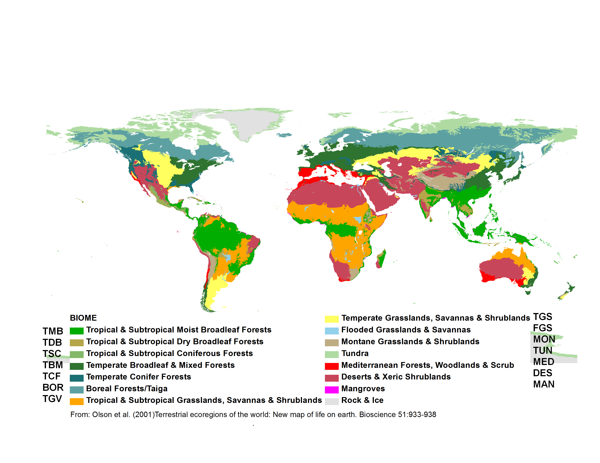

************************************************
## GrowthFormRaunkiaer (P)

Plant classification according to Raunkiaer (classified after the position of the overwintering buds)

Possible values

* Megaphanerophyte	e.g. Big trees (>30 m height)
* Mesophanerophyte	e.g. medium trees (8-30 m height)
* Nanophanerophyte	e.g. small trees (0.25-8 m height)
* Chamaephyte	Buds on persistent shoots near the ground
* Hemicryptophyte	Buds at or near the soil surface, e.g. daisy, dandelion
* Geophyte	Buds resting under dry ground, e.g. crocus, tulip
* Helophyte	Buds resting in marshy ground, e.g. reedmace, marsh-marigold
* Hydrophyte	Resting by being submerged under water, e.g. water-lily, frogbit
* Therophyte	Mostly annual plants
* Epiphyte	E.g. Epiphytes

For further information see www.en.wikipedia.org/wiki/Raunkiaer_plant_life-form.

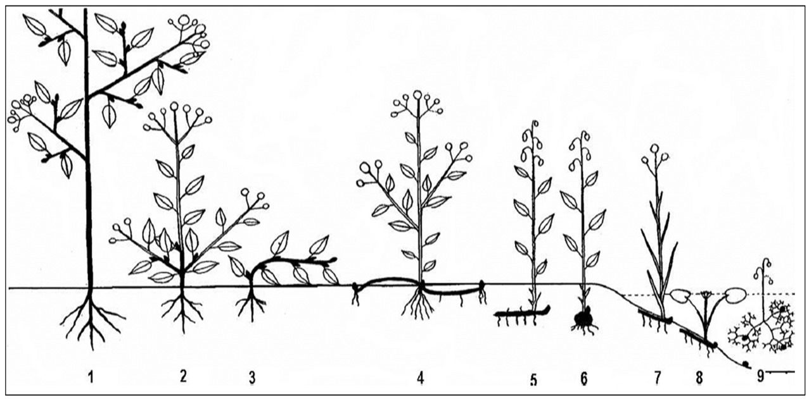

1. Phanerophytes
2. Chamaephyte
3. Chamaephyte
4. Hemicryptophyte
5. Cryptophytes, more specifically: Geophyte
6. Cryptophytes, more specifically: Geophyte
7. Cryptophytes, more specifically: Helophyte
8. Cryptophytes, more specifically: Hydrophyte
9. Cryptophytes, more specifically: Hydrophyte
10. Therophyte, aerophyte and epiphyte not shown

The description offered here is at the subsection level (e.g. “Cryptophytes” are classified as “Hydrophyte”, “Helophyte” or “Geophyte”; “Phanerophytes” are classified as “Nanophanerophytes”, “Mesophanerophytes” or “Megaphanerophytes”). When in doubt, information is to be retrieved from the internet (e.g. Wikipedia, Google photos) or the author is to be contacted. However, the variable “Plant type” typically relates to the variable “Growth form Raunkiaer” as it follows

* “Tree”, “Palm” and “Liana” are “Nanophanerophyte” (0.25-8 m height), “Mesophanerophyte” (8-30 m height) or “Megaphanerophyte” (>30 m height), depending on their maximum attainable heights as indicated in parentheses. * If you don't get this info from the paper, a quick Google photo search can give you an idea.
“Shrub” and “Succulent” are either “Chamaephyte” or (most often) “Nanophanerophyte”, but in some species they be “Mesophanerophyte”.
* “Herbaceous perennials” may be “Hydrophyte”, “Helophyte”, “Epiphyte”, “Geophyte”, “Hemicryptophyte” or “Chamaephyte”.
    + Hydrophyte: herbaceous perennial that lives in or really close to a lake, river or sea
    + Helophyte: herbaceous perennial that lives in a marsh or wetland
    + Geophyte: herbaceous perennial that overwinters below ground. These species have a storage below ground of the following types: rhizome, tuber, bulb or similar
    + Hemicryptophyte: herbaceous perennial without storage organ below ground that will overwinter right at ground level
    + Chamaephyte: herbaceous perennial that will overwinter above ground but no higher than 25 cm.
* “Annual” (and biennials or pseudo-annuals) are “Therophyte”.
* “Algae” is “Hydrophyte”.
* “Bryophyte” can be “Epiphyte” or “Hemicryptophyte”.
* “Epiphyte” is “Epiphyte”. Note that the Raunkiaer growth form “Aerophyte” is not used in this database. All “Aerophyte” (e.g. genus Tillandsia) are classified as “Epiphyte”.

************************************************

## IUCNStatus

Status of conservation of the species as a whole as per criteria of the International Union for the Conservation of Nature (IUCN).

* EX - Extinct - no known individuals remaining.
* EW - Extinct in Wild - known only to survive in captivity, or as a naturalized population outside its historic range.
* CR - Critically Endangered - extremely high risk of extinction in the wild
* EN - Endangered - high risk of extinction in the wild.
* VU - Vulnerable - high risk of endangerment in the wild.
* NT - Near Threatened - likely to become endangered in the near future.
* LC - Least Concern - Lowest risk. Does not qualify for a more at risk category. Widespread and abundant taxa are included in this category.
* DD - Data Deficient - not enough data to make an assessment of its risk of extinction.
* NE - Not Evaluated - has not yet been evaluated against the IUCN criteria.
* LR/cd - Lower Risk/conservation dependent - at lower risk of extinction, but requiring conservation intervention to maintain the population. This is an older (1994) category, not used in recent assessments.
* LR/nt - Lower Risk/near threatened - at lower risk of extinction, but considered to be near threatened. This is an older (1994) category, not used in recent assessments.
* LR/lc - Lower Risk/least concern - at lower risk of extinction, considered to be widespread and abundant. This is an older (1994) category, not used in recent assessments.

More detailed information on IUCN Red-list and Wikipedia Red List Categories

Several assessments have been carried out since the 1990s. Recent assessments use the 2001 IUCN Red List Categories and Criteria. Version 3.1. However, some taxa included in the current IUCN Red List database have not been reassessed since before 2000 and therefore still use the 1994 IUCN Red List Categories and Criteria. Version 2.3.

************************************************

## InvasiveStatus

Records whether the species is present in the Global Invasive Species Database. www.issg.org.

* No - Not present in ISSG database.
* Yes - Identified as invasive in ISSG database.

************************************************

## ConservationStatusUS

Records the conservation status under the U.S. Endangered Species Act, according to the United States Fisheries and Wildlife Service (http://www.fws.gov/endangered/). Note that in a few cases this information also applies to species outside of the US territory (e.g. emperor penguin).

* EN - Endangered
* TH - Threatened
* NA - Not classified

************************************************

## Purposes

The purpose columns describe the purpose(s) of the study detailed in the manuscript. This information is usually obvious from the abstract and the last paragraph of the intro. Several purposes are possible per study and for each purpose a 0 or 1 must be entered, representing "was __not__ a purpose"" and "was a purpose"" of the study respectively.

We have categorized the purposes as follows:

* Comparative demography - When the authors studied two or more species
* Spatial demography - When the authors studied the demography of two or more populations within the same species
* Abiotic impacts - When the authors studied the effects of abiotic factors (e.g fire, hurricanes, rain, fertilizers, droughts, etc)
* PVA - When the authors report a Population Viability Analysis of an endangered species
* Species dynamics description - When there is no actual treatment in the study (Unmanipulated). Instead, the goal was to describe the natural dynamics of a species
* Interspecific interactions - When the authors studied the interactions between different species (e.g herbivory, pollinators, inter-specific competition, predation, parasitism, etc)
* Management evaluation - When the authors explored the effects of a specific management plan (e.g. to eradicate an invasive species, to preserve an endangered species or assess effects of management on other species).
* Methodological advancement - When the novelty of the paper is not an ecological question, but mostly to introduce a new mathematical tool often using already published matrices

************************************************

## Treatment

Records any treatments of any kind other than control/unmanipulated.
Be concise with the treatment description. Multiple treatments should be separated with a semi-colon ";".
Enter "No" if the matrices are only obtained from unmanipulated conditions (for definition of "unmanipulated" see "MatrixTreatment" below).

************************************************

## StudyStart

Records the first year of the study, e.g. 2008

************************************************
## StudyEnd

Records the last year of the study, e.g. 2012

************************************************
## StudyDuration

Records the number of years of observation, e.g. 5.
This is calculated as: “StudyEnd” year - “StudyStart” year + 1. The calculation thus overlooks any missing years in the middle of the study period. Note that Excel should calculate the StudyDuration automatically since the formula is already set as default for that column. If it is not calculated by Excel please enter formula (not a calculated number) in case we get better information later.

************************************************
## AnnualPeriodicity

Frequency with which seasonal or annual the matrix population model was constructed. For example:

* 1	- Once a year
* 2	- Twice per year (e.g. in January and in June)
* 0.2	- Once every five years
* ? - Other annual periodicities

Annual periodicities can be calculated as follows: If the study site has been visited more than once a year calculate $1 * N$, where N is the number of visits to the site per year, e.g. $1 * 2 = 2$. If the study site has been revisited less than once per year calculate $1 / Y$, where Y is the number of years, e.g. $1/5 = 0.2$.

************************************************
## NumberPopulations

Number of populations of the study species. This could be any integer value and refers to the number of populations as defined by the author. Within-site replication of permanent plots are not considered to be different populations.

************************************************
## WithinSiteReplication

Reports the number of plots/transects sampled at each population and should give an accurate size description of the plots. For example, "6 (4x4 m^2^)" means that in each population, the authors established and followed six permanent plots of 4x4 m^2^. Be as specific but as brief as possible.

************************************************

## MatrixCriteriaSize

Records whether the matrix model is based on size (e.g. stem length/number, body length/mass, etc).

* criteria - The matrix population model contains stages based on size and this briefly describes the aspect of size that was measured to classify individuals (e.g. DBH, stem length, stem height, stem number, etc).
* No - The matrix population model is not based on size.

************************************************

## MatrixCriteriaOntogeny

Records whether the matrix model is based on ontogenetic stage (e.g. seedbank, reproductive, vegetative, dormant, etc).

* Yes	- The matrix population model contains at least one class that is based on development/ontogeny (e.g. seedbank, reproductive, vegetative, dormant, etc).
* No	- Matrix population model is not based on ontogeny.
* Based on size - Where the authors report ontogenetic stage class(es) but the stage class(es) themselves are based on size criteria (e.g. vegetative individuals defined as those <1 m height)

************************************************

## MatrixCriteriaAge

Records whether there are any classes that are based on age.

* Yes - The matrix population model contains at least one class that is based on age (e.g. individuals of 0 year old)
* No - The matrix population model is not based on age
* Based on size - If the stage classes are in reality based on size criteria (e.g. old individuals defined as those with >10 stems)

************************************************
## Taxonomy columns

This series of 22 columns includes taxonomic information.

* Kingdom - Kingdom to which species belongs.
* Phylum - Phylum to which species belongs e.g. Magnoliophyta.
* AngioGymno	Whether species is an angiosperm or a gymnosperm (record Angiosperm or Gymnosperm). If it is neither angiosperm nor gymnosperm fill in NA.
* DicotMonoc - Whether species is a dicot or monocot	(record Eudicot or Monocot). If species is neither dicot nor monocot (i.e. if it is not an angiosperm) fill in NA.
* Class - Class to which species belongs	e.g. Magnoliopsida.
* Family - Family to which species belongs	e.g. Polygonaceae.
* Order	- Order to which species belongs	e.g. Caryophyllales.
* Genus	- Genus used in SpeciesAuthor	e.g. Chorizanthe.
* SpeciesAccepted - Currently accepted Latin name. This information is is obtained from The Plant List.
* GenusAccepted	Taxonomic genus name of study SpeciesAccepted, as per The Plant List.
* SpeciesEpithetAccepted	Taxonomic species epithet name of study SpeciesAccepted (see above), as per The Plant List epithet e.g. pungens
* InfraspecificAccepted	Taxonomic infraspecific name of study SpeciesAccepted, as per The Plant List	infraspecies	e.g. pungens.
* TPLVersion - Version of The Plant List used for taxonomic validation	1.0	Version 1.0
* TaxonomicStatus - Taxonomic correspondence of SpeciesAuthor with SpeciesAccepted (above). Possible values include, NoMatch; Unresolved; Accepted; Synonym.
* NewGenus 
* NewSpecies 
* NewInfraspecific 
* Authority	- Taxonomic authority of SpeciesAccepted, as per The Plant List or Catalogue of Life.
* Typo
* WFormat

Those variables will be digitized and checked frequently by the database curators.

For COMPADRinos to get an idea of what kingdom, class etc means:

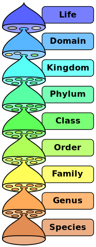

************************************************
# STACKED MATRIX FILES

************************************************
## EnteredBy

See __Student__ above.

************************************************
## EnteredDate

See __DateDigitalization__ above.

************************************************
## Source

Origin of data. If sources other than those below are used, a short but useful description should be given.
The aim of this column is that everybody can find the related information ASAP e.g. if something needs to be fixed.

* Author communication - Matrices derived from personal communication with author.
* Paper - Matrices derived from a published manuscript
* Old matrices - Matrices derived from an old matrices file (no more detailed description is available)
* _any database_	- Matrices derived from one of the various databases that have been merged into COMPADRE/COMADRE see __Database__ above.
* Online appendix -	Matrices derived from the online appendix of publication
* Book - Matrices derived from a book
* Other sources - Matrices derived from any other source.

************************************************
## SpeciesAuthor

See __SpeciesAuthor__ above.

************************************************
## StudiedSex

Indication of the sex(es) considered when constructing the matrix population model.

* M	- Studied only males
* F	- Studied only females
* H	- Hermaphrodites
* M/F	- Males and females separately in the same population matrix model
* A	- All sexes together

************************************************

## MatrixComposite

Indicates the type of matrix population model (See the figure below for more information).

* Individual - A matrix population model constructed for a single study × species × population × treatment × period combination
* Mean - An average (arithmetic mean) of other matrix population models (e.g. element-by-element arithmetic mean of a population's matrices across several time periods available)

__Note:__ Generally, the mean values of unmanipulated and treatment matrices are to be kept independent of each other (i.e. never calculate mean matrices across both unmanipulated and treatment matrices), and a mean matrix for different treatments should not to be calculated/digitized in the database.

* Pooled - A matrix population model that has been constructed by pooling individual-level demographic information across populations and/or periods. This type of matrix, when available, has always been provided by the author either in the publication or through personal communications

* Seasonal - A matrix population model that does not describe a full annual transition, but rather a seasonal (< 1 yr) transition

A matrix can be seasonal even if a it is constructed over several years e.g. spring in years 2000-2012. Make sure you detail that there are multiple years data in the observation column.

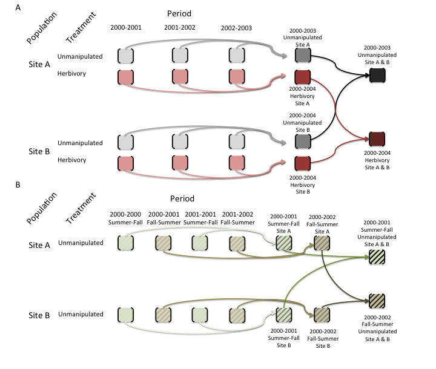
This figure is a schematic showing how mean population matrix models are derived from all available population matrix models in a study.

A. For annual population matrix models (those that follow population dynamics from one year to the next, or sometimes more – some tree species are studied with a 5-year interval), element-by-element means are first calculated across the population matrix models describing the population dynamics for time periods within each population. Then the grand element-by-element mean is calculated across the matrix population models for the different populations. This procedure is repeated for models describing dynamics under each imposed treatment (pink matrices below) and for those describing the dynamics of unmanipulated populations (gray). Note that mean population matrix models are only calculated from population matrix models that share the same treatment (or absence of treatment).

B. For seasonal or periodic population matrix models (e.g. for annual species), the mean seasonal population matrix model is calculated within populations and then across populations, both for matrices describing treated populations and for those describing populations with no imposed treatment (i.e. unmanipulated).

************************************************
## MatrixTreatment

Describes if a treatment was applied or not, and the nature of the treatment.

* _treatment_ - Provides a brief description of the treatment applied to the population described by the matrix population model. We define treatment as an action intentionally imposed by humans. If more than one applies to a matrix, multiple treatments are separated with a “; ”.

* Unmanipulated	- No experimental, human-imposed treatment was applied. Natural events of non-intentional occurrence (e.g. fire, hurricanes) are recorded as “Unmanipulated”, but these incidences are described in the __Observations__ variable.

************************************************
## MatrixCaptivity

Indicates whether the study species was studied in the wild or under controlled conditions for most of its life cycle.

* __W__	- Wild: the study was carried out in natural conditions.
* __C__ - Captive: the study was carried out for most part of the life cycle of the species in a botanical garden, green house, laboratory, etc.
* __CW__ - Captured from wild: the study was carried out on a population that was captured from wild.
* __C;W__ - Mixed	studies that incorporate vital rates from both captive and wild populations.

************************************************
## YEAR/SEASON/MONTH

These 6 columns describe the temporal aspects of the study for each matrix.

### MatrixStartYear

First year of study. Year $t$ in annual matrix population model that describes population dynamics from time $t$ to $t+1$. e.g. 1995.

************************************************
## MatrixStartSeason

Numeric indication of the first season of study. Season $s$ in periodic matrix population model that describes population dynamics from season $s$ to $s+1$. Seasons are naturally hemisphere-specific, and this information can be deduced from variables __Country__ and __LatDeg__, below. Here season is used as described in manuscript by the authors (i.e. summer in the southern hemisphere corresponds to winter in the northern hemisphere)

1.	Spring
2.	Summer
3.	Autumn or Fall
4.	Winter

************************************************
## MatrixStartMonth

Numeric indication of the first month of study. Month $m$ in periodic matrix population model that describes population dynamics from month $m$ to $m+1$

1. January
2. February
3. March
4. April
5. May
6. June
7. July
8. August
9. September
10. October
11. November
12. December

************************************************
## MatrixEndYear

Last year of study. Year $t+1$ in matrix population model that describes population dynamics from time $t$ to $t+1$. e.g. 2001.

************************************************
## MatrixEndSeason

Numeric indication of the end season of the matrix.

1.	Spring
2.	Summer
3.	Autumn or Fall
4.	Winter

************************************************
## MatrixEndMonth

Numeric indication of the last month $m$ of study. Month $m+1$ in periodic matrix population model that describes population dynamics from month $m$ to $m+1$.

1. January
2. February
3. March
4. April
5. May
6. June
7. July
8. August
9. September
10. October
11. November
12. December

__Note:__ _All study time information always belong to the related matrix. So for a mean matrix the whole study duration must be recorded (e.g. MatrixStartYear 1998 together with MatrixEndYear 2005) while for a mean matrix the specific year or seasonal information must be given (e.g. Matrix StartYear 2001 together with MatrixEndYear 2002, or “MatrixStartYear 2001, MatrixStartSeason 1” together with “MatrixEndYear 2002, MatrixEndSeason 2”_

This is how it possibly looks like (this is a 6x6 mean (the upper one) and individual (the lower one) matrix for the algae Alaria_nana)

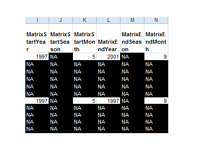

************************************************
## MatrixPopulation

The name of population where the matrix was recorded, usually as given by the publication author. For example “Brazeau Creek, Florida”. When the author provides no name, the closest geographic location is assigned as name. If there are multiple populations in the study and their names are not pertinent/available, sequential names in alphabetical order are assigned for each population in the study (e.g. “A”, “B”, “C”, etc).

************************************************
## Geolocation columns

These 11 columns describes the location of each matrix.

__Always__ check geolocation with Google Earth! If the geolocation from Google Earth does not fit the study site description ask author for further information and use one of the comments for the __Observation__.

### LatDeg / LatMin / LatSec

Record the degree (0-90), minute (0-60) and second (0-60) values of the locations of the matrix.
If no LatSec is available type in a zero. This means: the value “0” may mean precise values are not available! If the geolocation is given as e.g. 58° 06' N 17° 26' E we do not enter "06" into the LatMin / LatSec column but only "6".

### LatNS

Cardinal direction

* N - North
* S - South

__Note:__ Cardinal direction might be given with a “+” or “-“ whereat “+” means North and “-“ means South.

### LonDeg / LonMin / LonSec

Records the degree (0-90), minute (0-60) and second (0-60) values of the locations of the matrix.

### LonWE

Cardinal direction

* W - West
* E - East

__Note:__ Cardinal direction might be given with a “+” or “-“ whereat “+” means East and “-“ means West.

### Altitude

Altitude of studied population in m = Height above sea level of specific population in meters e.g. 208m.

__Note:__ Height is either given in the paper, by author communication, or we look it up with Google Maps. If you enter the coordinates into Google Maps you’ll see the altitude at the bottom right corner of the window. If you scroll around in Google maps with your mouse the altitude will change, so pay attention that you read the altitude directly after entering the coordinates without scrolling around!

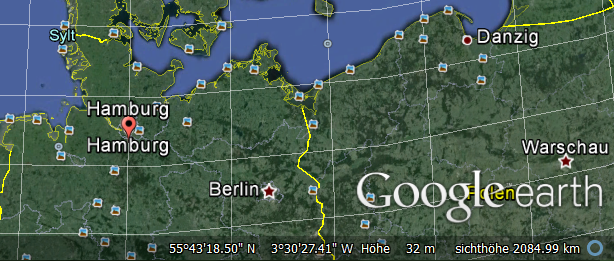

### Country

The ISO 3 Country Code(s) of where the study took place. If the study involves multiple countries, these are separated by "; ". https://en.wikipedia.org/wiki/ISO_3166-1_alpha-3.

Where studies are conducted in seas or oceans this becomes a bit more challenging. We will provide country information where pertinent (i.e. in waters under the jurisdiction of a country) but where this is not possible, we will use a code to describe that sea or ocean: NODC For example, a fish species studied in French territorial waters in the Bay of Biscay would be recorded as “Country” = “FRA; NODC-22” (for France, and the NODC code for the Bay of Biscay). If the population was studied both in French and Spanish waters the code would be “FRA; SPA; NODC-22”. If it was only studied in international waters (normally defined as 12 nautical miles (for explanation see here) then you would record it as “NODC-22”.

### Continent

Continent where study took place

* Africa
* Asia
* Europe
* N America (includes Canada, USA and Mexico)
* S America (the rest of the countries in the Americas)
* Antarctica
* Oceania (various definitions for Oceania exist, but here we opted for this one: https://en.wikipedia.org/wiki/List_of_Oceanian_countries_by_population)

### General notes on location information

If you don’t have a detailed description of the geolocation-coordinates enter the following sentence into the __Observation__-Column: The GPS coordinates were approximated to the closest geographic location described in the reference. Sometimes the Lat and Long given in the paper do NOT match the study area. In this case enter the following in the __Observation__-Column: GPS co-ordinates cited exactly as reported in original paper. These do not match written study site description.

__Pay attention to the means:__ We don’t calculate ranges e.g. for mean matrices. In that case we enter NC for “not calculated” into the columns LatDeg, LatMin, LatSec, LatNS, LonDeg, LonMin, LonSec, LonWE and Altitude. In columns Country and Continent we separate with “;” if the study was located on more than one country / continent.

This is how it possibly looks like (this is a 6x6 mean (the upper one) and individual (the lower one) matrix for the algae Alaria_nana)

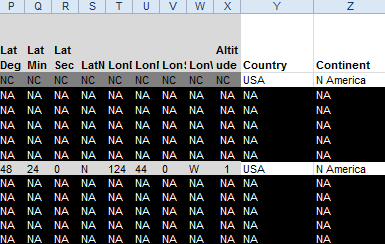

************************************************
## MatrixSplit

Indicates the type of matrix population model, i.e. can A it be divided into U, F and C sub-matrices? If a matrix is divisible, we divide it! Then always insert all sub-matrices – even if e.g. C only has zeros!

* Divided - The matrix population model A has successfully been divided into the process-based sub matrices U, F and C.
* Indivisible - The matrix population model A has not been divided into the process-based sub-matrices U, F and C (see Figure below for further details) because insufficient information is available to classify the various demographic processes for each sub-matrix. In indivisible matrices, only A (see below) is presented.

This is how it possibly looks like (these are two divisible 4x4 matrices for the herb _Dactylorhiza lapponica_):

This is how it possibly looks like (this is a indivisible 5x5 matrices for the herb _Syngonanthus nitens_):

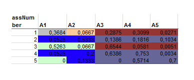

The diagram below shows the life cycle of two hypothetical plant populations based on age (A) and size (B), with their corresponding matrix population models. A, and underlying basic demographic processes of survival (U sub-matrix; solid arrows), sexual reproduction (F sub-matrix; dashed arrows) and clonal reproduction (C sub-matrix; dotted arrows). In the Leslie matrix model example (A), the division of sub-matrices is more straightforward than in the Lefkovitch matrix model example (B). In the latter imaginary example, individuals can transition into the same stage as they can contribute with sexual and/or clonal offspring (e.g. small stage). In these cases, splitting A into sub-matrices U, F and C is only feasible when sufficient information is provided by the authors (see variable MatrixSplit in above).

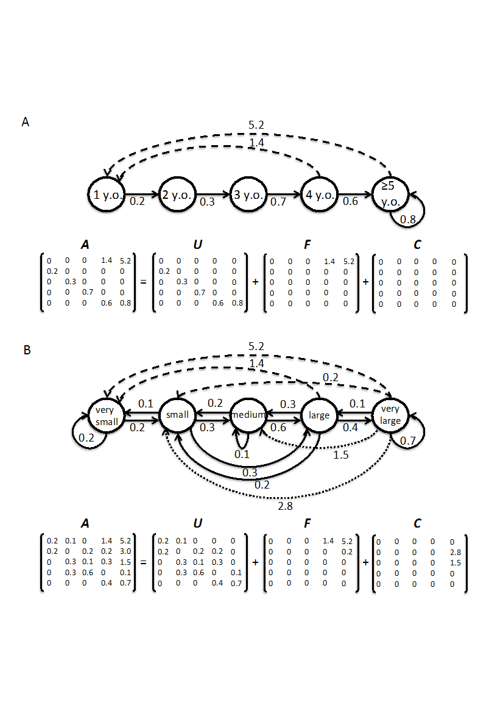

************************************************
## Observation

Any useful additional information about the population matrix model that is not provided elsewhere but may nonetheless be important (e.g. plant canopy, burning intervals, etc.)

Some standardized sentences:

* The GPS coordinates were approximated to the closest geographic location described in the reference. (see Geolocation)
* GPS co-ordinates cited exactly as reported in original paper. These do not match written study site description. (see Geolocation)
* Geolocation / Altitude from descriptor: (if no matrices are enters yet but a geolocation information are available)
* Matrix is calculated with stochastic model
* X years since last fire
* Calculated with demographic data from Author JournalName YearPublished
* Data is from a greenhouse experiment
* MatrixClassAuthor is not clarified

__Note:__ _Information in the observation-column refer only to the matrix next to the column! If an information is important for all matrices of that species it must be copy & pasted for every matrix._

************************************************
## MatrixClassOrganized

We standardize all stages in a given population matrix model to one of three stages (prop, active, dorm) to facilitate analyses.

* prop - Propagule (seed). This applies to every stage defined by the author as seed bank or seed. Users are encouraged to carefully examine matrices with these stages and to implement the appropriate calculations to avoid a spurious additional year being added when no seedbank exists in the study species, as explained by Caswell (2001, p. 60).
* active - This includes stages that can neither be placed in the “prop” nor “dorm” (see below) stages.
* dorm - A stage that is vegetatively dormant after having germinated and becoming established.

************************************************
## MatrixClassAuthor

The stage description as indicated in the source by the publication author of the matrix population model. When possible, we add units (e.g. cm, m, cm^2^)

Some information on how to correctly write things in that column:

* First letter must be a capital letter (e.g. Adult: 100-150 cm DBH)
* If the Author uses abbreviations first write them down, followed by a “:” and the explanation of that abbreviations
* Use the most detailed description
* Always add units (when possible) (e.g. 0-9 cm DBH, not 0-9 DBH)
* Be clear in what is described (e.g. 0-9 cm DBH/ height, not only 0-9 cm)
* Make sure that you use “.” Instead of “,” when typing numbers (e.g. 1.45 cm, not 1,45 cm)
* Make sure that there is space between the number and the unit (e.g. 1.45 cm, not 1.45cm)
* We use exact the same description as the author did. If the paper is in another language (e.g. all the Spanish stuff from Iriondo Book 2009) we also write down the stages in that foreign language (e.g. in Spanish).
* Also write down abbreviations - if the author used them frequently (e.g. if the author explains his stages in the text and after that only uses "S1, S2, J1, J2, J3, A, R" write them down, too (= s1 = dormant seeds)

************************************************
## MatrixClassNumber

A numerical representation of classes in the population matrix model. Numbers starting with 1 (__not 0__). e.g. 1,2,3, ... $n$, where $n$ is the dimension of the population matrix.

************************************************
## matU/matF/matC/

The population matrix models. Including the overall matrix (A) and, where possible, the sub-matrices U (survival), F (fecundity), C (clonality). A range of numeric values is possible in each element of the matrix.

* The A matrix -  Transition probabilities are constrained between 0 and 1. Reproductive values are always positive but have no upper bound.

* The U matrix - The population sub-matrix model U (a sub-matrix of A), describes the survival-dependent dynamics of a population under the conditions described above. A range of numeric values possible, but are constrained to be between 0 and 1. These include only survival-dependent vital rates (no sexual or clonal reproduction).

* The F matrix - The population sub-matrix model F (a sub-matrix of A), which describes the sexual-reproduction dynamics of a population under the conditions described above. A range of numeric values possible, but are constrained to be positive. These include only estimates of sexual reproduction (no clonal reproduction).

* The C matrix - The population sub-matrix model C (a sub-matrix of A), which describes the clonal-reproduction dynamics of a population under the conditions described above. A range of numeric values are possible, but these are constrained to be positive. These include only estimates of clonal reproduction.

The values for the U, F and C matrices are only digitized for “Divided” matrices (indicated by variable __MatrixSplit__)

__Note:__ _Leave one column filled with NAs between two separated matrices._

************************************************
## Color coding

Within the Excel sheets we  color code all matrices in the same standardized way. The “color palette” can easily be found in (and copy pasted from) all stacked files (last tab).

__unique cells__ (only one reproduction- or transition-form exists)

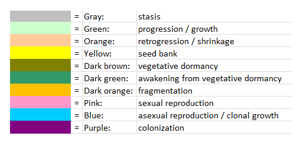

__mixed cells__ (more than one reproduction- or transition-form exists)

__other colored cells__

All matrices are to be digitized using color-codes for the matrix elements $a_{ij} >0$. If more than one process co-occur in the same cell, the author is to be contacted (or the database curator to be consulted). Used only the colors indicated in the tab "color palette" (and above). Leave one column filled with NAs between two separated matrices.

__Note:__ _Use only this colors for each of the different demographic processes. Our automatized matrix splitting procedure will not recognize the process otherwise and you will have to end up doing it by hand yourself otherwise._

__Example:__ Matrix example for color-coding. Note that the coloring scheme is for internal usage only. The color names are the ones defined by Excel, and the user will not see them, as only text-based files will be made available to end users. We use these colors to separate divisible matrices automatically through a machine learning algorithm into U (survival), F (sexual reproduction) and C (clonal reproduction) matrices.

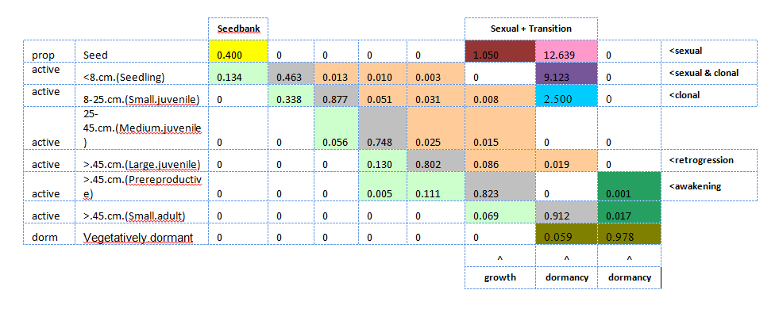

************************************************
